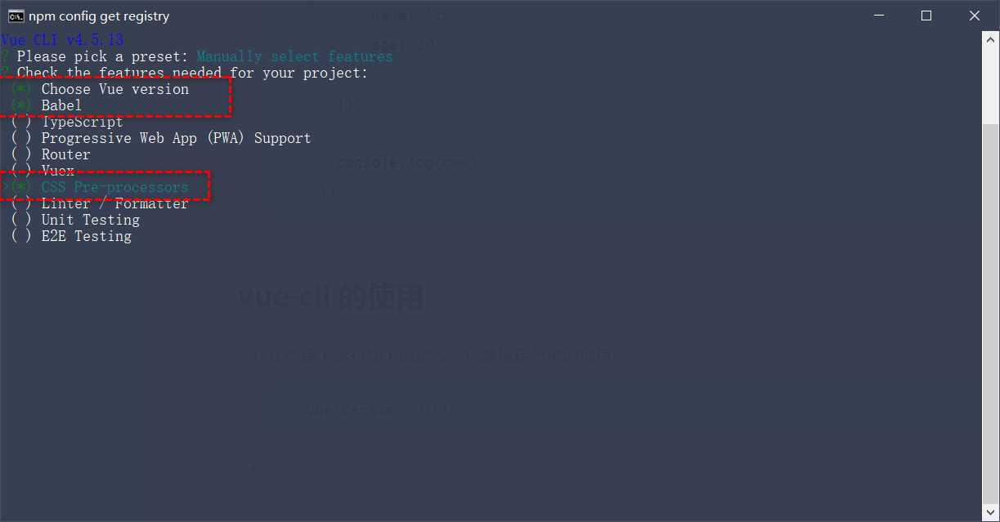

## 购物车案例


### 初始化项目基本结构

####  vue-cli 的使用

- 在终端下运行如下的命令，创建指定名称的项目：

```bash
vue cerate 项目的名称
```

- vue 项目中 src 目录的构成：

```
assets 文件夹：存放项目中用到的静态资源文件，例如：css 样式表、图片资源
components 文件夹：程序员封装的、可复用的组件，都要放到 components 目录下
main.js 是项目的入口文件。整个项目的运行，要先执行 main.js
App.vue 是项目的根组件。
```

- 终端操作步骤





### 封装 MyHeader 组件

```  javascript
<template>
  <div class="app-container">
    <Header></Header>
    <h1>App 根组件</h1>
  </div>
</template>

<script>
//导入
import Header from '@/components/Header/Header.vue'
export default {
  components: {
   //注册
    Header
  }
}
</script>
```


### 基于 axios 请求商品列表数据

（ GET 请求，地址为 https://www.escook.cn/api/cart ）

- npm 安装axiox包

``` xml
npm i axios -S
```

- 项目报错原因：原先vue项目残留包导致安装失败

```shell
PS D:\vue_cli> npm i axios -S
npm WARN deprecated sourcemap-codec@1.4.8: Please use @jridgewell/sourcemap-codec instead
npm WARN deprecated chokidar@2.1.8: Chokidar 2 will break on node v14+. Upgrade to chokidar 3 with 15x less dependencies.
npm WARN deprecated chokidar@2.1.8: Chokidar 2 will break on node v14+. Upgrade to chokidar 3 with 15x less dependencies.
npm WARN deprecated fsevents@1.2.13: fsevents 1 will break on node v14+ and could be using insecure binaries. Upgrade to fsevents 2.
npm WARN deprecated fsevents@1.2.13: fsevents 1 will break on node v14+ and could be using insecure binaries. Upgrade to fsevents 2.
npm ERR! Cannot read properties of null (reading 'pickAlgorithm')

npm ERR! A complete log of this run can be found in:
npm ERR!     C:\Users\l\AppData\Local\npm-cache\_logs\2022-12-30T19_08_36_110Z-debug-0.log

```

- 解决办法：强制删除重新安装

```shell
PS D:\vue_cli> npm cache clear --force
npm WARN using --force Recommended protections disabled.
PS D:\vue_cli> npm i 
PS D:\vue_cli> npm i axios -S
added 3 packages, and changed 1 package in 3s
```

- 继续报错：vue_cli/vue-cli-service版本不匹配或者过低

```shel
 ERROR  Error loading D:\vue_cli\vue.config.js:
 ERROR  TypeError: defineConfig is not a function
```

- 解决办法：更新vue

```shell
vue upgrade
```

- 继续报错: webpack不匹配或者版本过低

```shell
 ERROR  ValidationError: Progress Plugin Invalid Options
```

- 解决办法： 进行跟新webpack

```
npm i webpack@latest -D
```

- 成功运行

```javascript
<script>
// 导入axios请求库
import axios from 'axios'
// 导入Header 组件
import Header from '@/components/Header/Header.vue'
export default {
  data() {
    return {
      // 存储购物车的列表数据
      list: []
    }
  },
  created() {
    // 在该生命周期中调用
    this.initCartList()
  },
  methods: {
    async initCartList() {
      //调用get
      const { data: res } = await axios.get('https://www.escook.cn/api/cart')
      // 只要请求回来的数据需要用到必须转存到data
      if (res.status === 200) {
        this.list = res.list
      }
    }
  },
  components: {
    // 注册
    Header
  }
}
</script>
```


### 封装 MyGoods 组件

- 导入 注册Goods组件
- 父向子传参：将axios请求内容传递给子组件

```xml
<template>
  <div class="app-container">
    <Header></Header>
    <!-- 循环渲染list数据每一个商品的信息 -->
    <Goods v-for="item in list" :key="item.id" :title="item.goods_name" :pic="item.goods_img" :price="item.goods_price"
      :status="item.goods_state" :id="item.id">
  </div>
</template>
```

- 子组件自定义属性接收

```javascript
<script>
export default {
  // 自定义属性
  props: {
    // 需要通知父组件数据的更改
    id: {
      required: true,
      type: Number
    },
    // 要渲染商品的标题
    title: {
      default: '',
      type: String
    },
    // 要展示的商品图片
    pic: {
      default: '',
      type: String,
    },
    price: {
      default: '',
      type: Number
    },
    status: {
      default: true,
      type: Boolean
    }

  }
}
</script>
```

- 进行赋值

```javascript
<template>
  <div class="goods-container">
    <!-- 左侧图片 -->
    <div class="thumb">
      <div class="custom-control custom-checkbox">
        <!-- 复选框 -->
        <input type="checkbox" class="custom-control-input" id="cb1" :checked="status" @change="stateChange" />
        <label class="custom-control-label" for="cb1">
          <!-- 商品的缩略图 -->
          
        </label>
      </div>
    </div>
    <!-- 右侧信息区域 -->
    <div class="goods-info">
      <!-- 商品标题 -->
      <h6 class="goods-title">{{ title }}</h6>
      <div class="goods-info-bottom">
        <!-- 商品价格 -->
        <span class="goods-price">￥{{ price }}</span>
        <!-- 商品的数量 -->
      </div>
    </div>
  </div>
</template>
```

- 子向父传参：对于复选框checked属性修改的双向统一

> change事件，监听复选框状态变化  
>
> 注意：一定要更改id


```javascript
<!-- 复选框 -->
		<input type="checkbox" class="custom-control-input" :id="'cb' + id" :checked="state" @change="stateChange" />
        <label class="custom-control-label" :for="'cb' + id">
```


```javascript
// 拿到最新的checked状态值
    getNewstate(val) {
      this.list.some(item => {
        if (item.id === val.id) {
          item.goods_state = val.value
          // 终止后续的循环
          return true
        }
      })
    }
```

### 封装 MyFooter 组件

- 父组件全部选中--Footer组件复选框选中

> 1.父向子传值： 在子组件定义自定义属性

```javascript
// 全选的状态
    isfull: {
      type: Boolean,
      default: true
    },
```

> 2.在父组件得出全选框的值 fullstate 采用计算属性

```javascript
computed: {
    // 动态计算出全选的状态是 true 还是 false
    fullState() {
      //every 如果商品都是选中状态则返回true 表示全部显示  起一个查询的作用
      return this.list.every(item => item.goods_state)
    }
  },
```

> 3.子组件接受并交给复选框

```javascript
 <input type="checkbox" class="custom-control-input" id="cbFull" :checked="isfull" @change="fullChange" />
```

- Footer组件复选框选中--父组件全部选中

> 4.子向父传值：自定义事件

```javascript
methods: {
    // 监听到了全选的状态变化
    fullChange(e) {
      this.$emit('full-change', e.target.checked)
    }
  }
```

> 5.父组件接受

```javascript
 <Footer :isfull="fullState" :amount="amt" :all="total" @full-change="getFullState"></Footer>
```

> 6.调用函数改变数据

```javascript
// 接收 Footer 子组件传递过来的全选按钮的状态 foreach起一个操作的作用
    getFullState(val) {
      this.list.forEach(item => (item.goods_state = val))
    }
```

- 父向子传值--自定义属性

> 计算选中商品的价格

```javascript
// 已勾选商品的总价格
    amt() {
      // 1. 先 filter 过滤 提取所有选中的商品
      // 2. 再 reduce 累加 将选中商品的价钱计算
      return this.list
         .filter(item => item.goods_state)
        .reduce((total, item) => (total += item.goods_price * item.goods_count), 0)
    }
```

- 父向子传值--自定义属性

> 所有选中商品

```JavaScript
// 已勾选商品的总数量
    total() {
      return this.list.filter(item => item.goods_state).reduce((t, item) => (t += item.goods_count), 0)
    }
```


### 封装 MyCounter 组件

- 兄弟组件传输

> 新建bus组件 子组件引用并注册

> 为加减组件绑定点击事件以及构造函数

```javascript

<template>
  <div class="number-container d-flex justify-content-center align-items-center">
    <!-- 减 1 的按钮 -->
    <button type="button" class="btn btn-light btn-sm" @click="sub">-</button>
    <!-- 购买的数量 -->
    <span class="number-box">{{ num }}</span>
    <!-- 加 1 的按钮 -->
    <button type="button" class="btn btn-light btn-sm" @click="add">+</button>
  </div>
</template>

```

```javas
add() {
      const obj = { id: this.id, value: this.num + 1 }
      bus.$emit('share', obj)
    },
```

```javascript
sub() {
      if (this.num === 1) return
      const obj = { id: this.id, value: this.num - 1 }
      bus.$emit('share_', obj)
    }
```

> 父组件引入注册bus 
>
> 在生命周期created()节点调用函数通过筛选使对应id的商品数量更改

```javascript
created() {
    // 在该生命周期中调用
    this.initCartList(),
      bus.$on('share', val => {
        this.list.some(item => {
          if (item.id === val.id) {
            item.goods_count = val.value
            return true
          }
        })
      }),
      bus.$on('share_', val => {
        this.list.some(item => {
          if (item.id === val.id) {
            item.goods_count = val.value
            return true
          }
        })
      })
  }
```

