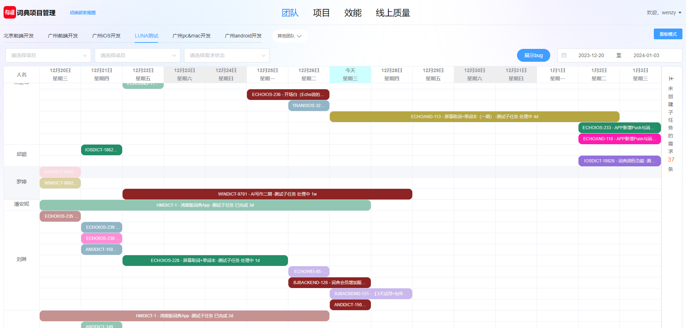
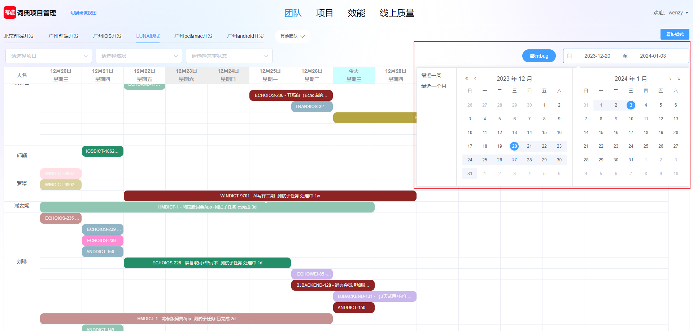
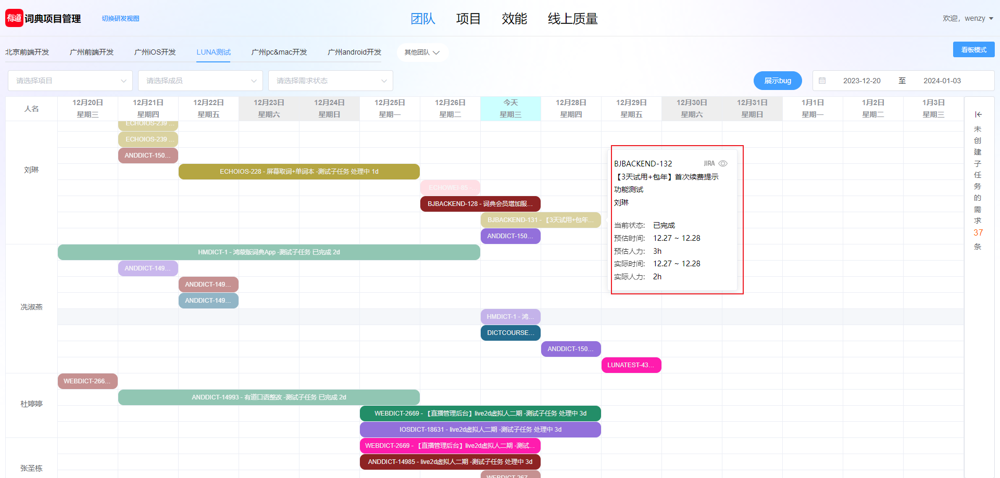
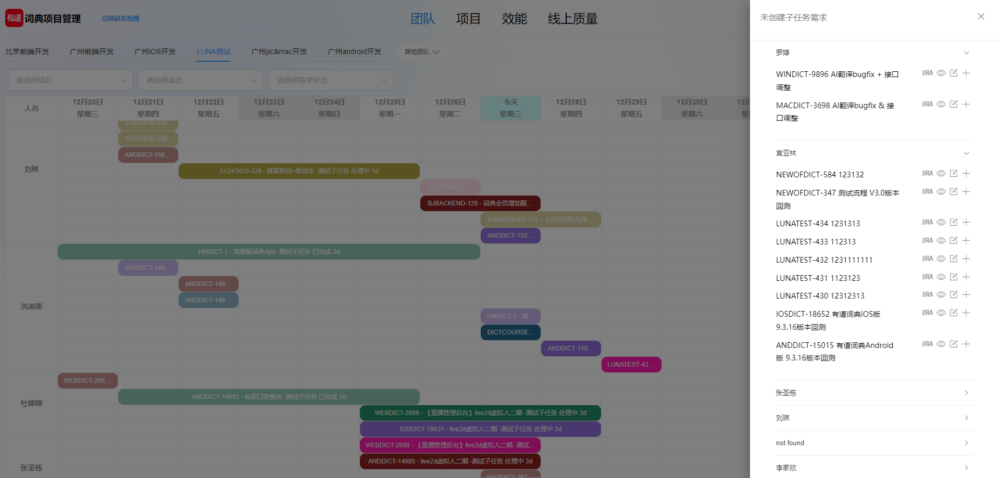

# 效能研发平台
source\img\kanban\image-20231227182336077.png

- 日历计算 ：参考pingcode排期表是可滑动的，但是这样表头初始时间戳不易确定，那么对应任务起止时间不易与表头作比较无法形成关联，所以可以看到我在右边设置了日历组件，使用elementui的DateTimePicker 日期时间选择器组件，其目的是为了让用户传入两个确定的时间戳，基于这两个时间戳通过newDate()内置API，getTime() getDate()等计算得到区间内的年月日星期，时间戳，将他们封到一个对象，再把所有天存入一个数组，那么通过table表格循环渲染得到日历，对今天和周六日进行标记

- 任务起止和表头关联：获取到任务数组时，这里思考如何可以在对应区段内进行展示，首先是把表格一行全部填满，取任务起止时间戳，与刚才计算出的对应表头对象中的当天时间戳进行比较，通过v-if判断展示条件以此与表头进行关联，这里有一个小细节，就是把任务起止时间进行拓宽，比较时任务开始时间应该取到当天最开始的00点，通过toLocaleDateString方法，任务结束时间取到当天最晚，然后判断表头当天时间戳是否在这一区段这样才能保证不会有遗落，

  

- 合并行列：后端返回的数据结构是并列的，这里涉及到表格合并方法objectSpanMethod，对于相同人名进行聚合，将左侧列合并，难点是对于列的合并，按照之前先填满后判断的方法展示的是独立的子块，聚合时应该判断当天是否是第一天，然后以任务起止时间段确定占几列进行分配，将其余的子块不分配列，细节在于当有任务被截断了，开始时间比规定时间早，但结束时间又在规定范围内，这一部分要展示，需要分开判断后续分配几列，主要是判断逻辑，

- 表格还有其他功能，点击会有展示，可以看任务详情和编辑等等，接入组件这里不多说了使用Popover 弹出框，右侧抽屉drawer组件

- 点击可以展示子任务的bug，因为对于某需求的bug数据比较多，接口会变慢所以这里和任务的接口是分开的，请求做预加载处理，默认是不展示bug的，有前端进行数据的拼接在对应人名后接入对应的bug，由于两字段有所区别，难点在于拼接时候的处理逻辑和判断展示逻辑，使表格能够兼容